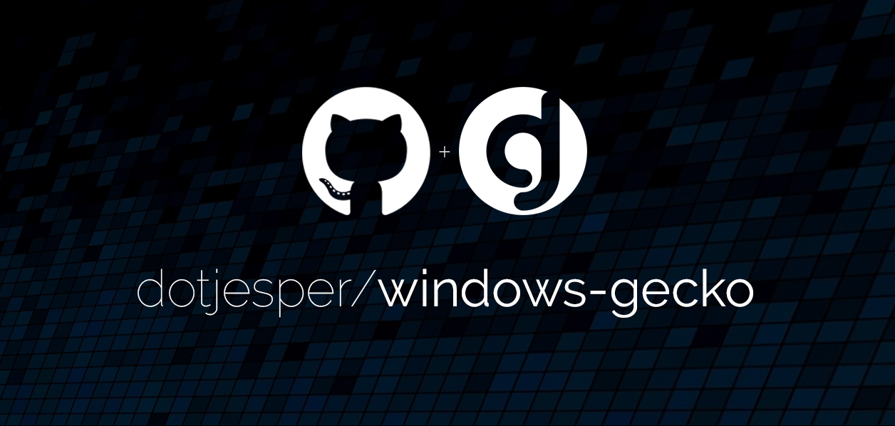

# Windows **gecko**

[](https://windows.com/ "Built for Windows 11")
[](https://windows.com/ "Built for Windows 10")
[](https://learn.microsoft.com/autopilot/overview/ "Windows Autopilot")

[](https://learn.microsoft.com/powershell/module/psscriptanalyzer/ "PowerShell Script Analyzer")
[](https://learn.microsoft.com/powershell/module/microsoft.powershell.core/about/about_language_modes/ "PowerShell Language mode")

This repository contains the source code for **Windows gecko**.


This repository is not just another PowerShell repo - it is also a personal learning platform for GitHub best practices, repository management, and solution design. The goal is for this repo to serve as a template for future projects. If you have comments, ideas, or suggestions, please use [Discussions](https://github.com/dotjesper/windows-gecko/discussions "Join the discussion") section.

For more on the practices used in this project, see these posts on [dotjesper.com](https://dotjesper.com/):

- [How to name your PowerShell scripts and functions](https://dotjesper.com/2025/how-to-name-your-powershell-scripts-and-functions/)
- [How to validate and improve your PowerShell scripts](https://dotjesper.com/2025/how-to-validate-and-improve-your-powershell-scripts/)
- [How to set up a well-configured repository](https://dotjesper.com/2026/how-to-set-up-a-well-configured-repository/)

This repository is the evolution of the Windows rhythm script. During the progression of the solution, I introduced breaking changes and decided to rebrand it as **Windows gecko**.

> [!IMPORTANT]
> **Version 1.5.2 is a major overhaul of the solution and includes breaking changes.** The script and configuration schema have been thoroughly reviewed, restructured, and improved. As part of this effort, AI was used to assist with reviewing and refactoring parts of the codebase, including optimizing phrases, log entries, correcting spelling errors, and improving grammatical consistency. Notable changes include breaking changes to **windowsTCR** and other significant updates across feature modules. If you are upgrading from a previous version, please review your configuration files carefully and test thoroughly in a non-production environment before deploying. See the [change log](https://github.com/dotjesper/windows-gecko/wiki/Change-Log) for full details.

## Idea

According to Wikipedia, geckos are small, mostly carnivorous lizards that have a wide distribution, found on every continent except Antarctica. Geckos are small in size, can adapt to the surroundings and communicate using clicking sounds in their social interactions.

> Geckos are small, adapt to the surroundings and have excellent night vision.

**Windows gecko** is exactly that, a multifunctional script, small in size, designed to adapt to multiple Windows management environments and using "clicking sounds" to ensure every step is checked and recorded.

This repository is under development and actively maintained. This is a personal development - please respect the community sharing philosophy and be nice! Feel free to fork and build.

## Goal

The goal of **Windows gecko** is to provide a consistent desired state configuration to end user devices in [Windows Autopilot](https://learn.microsoft.com/autopilot/overview/ "Overview of Windows Autopilot") scenarios.

Windows gecko can easily be implemented using more traditional deployment methods, e.g., Operating System Deployment (OSD), Task Sequences deployment or similar methods.

> [!IMPORTANT]
> Windows gecko is a **desired state configuration** tool - not a policy enforcement solution. The purpose is to set sensible defaults and baselines for end users, not to restrict or prevent users from changing settings. Policy-based restrictions should be managed through dedicated management solutions such as Microsoft Intune, Group Policy, or similar platforms. While nothing in the script prevents administrators from configuring policy-like registry settings through Windows gecko, this is not the intended use case and goes against the design philosophy of the project.

## Synopsis

**Windows gecko** was created to remove some Windows features from Windows devices, managed by Microsoft Intune, and advanced into a tool to match Windows feature configuration, allowing to disable and enable Windows features. While developing the key features, more requirements emerged, and the ability to baseline Windows In-box Apps was added, allowing administrators to easily uninstall unwanted apps as part of the initial configuration, e.g., when applying corporate defaults as part of Windows Autopilot scenarios.

More enhancements were added, baseline conditions were asked for, and Windows Service configuration and Windows Registry configuration options were included, and more features have been added and more ideas are cooking.

There are several methods to achieve a Windows **desired state configuration** baseline and several approaches. **Windows gecko** is based on the requirement to provide a default configuration baseline, or a desired state configuration, and is not meant to prevent the end user from installing a previously uninstalled app, or bypass a desired setting, only to allow device administrators to provide a default baseline, or corporate baseline, to the end user as part of a [Windows Autopilot](https://learn.microsoft.com/autopilot/overview/ "Overview of Windows Autopilot") scenario.

The mindset of the solution will aim to allow to limit and/or combine the functionalities best suited for the task, meaning if Windows feature configuration were to be applied, this should be possible without the Windows Registry configuration. Also, especially important, is to be able to apply Windows baseline configurations in one or more packages in either system or user context, without changing the code – which is why all configurations are possible using configuration files (json). This will help ensure minimal effort to create a new Windows desired state configuration, which is easily done without any code changes or re-signing the code.

## Feature modules

Each feature is implemented as a module, controlled through the JSON configuration file. Modules not present in the configuration file or set to `enabled: false` are skipped during execution and logged as "not enabled", allowing you to include only the features needed for each task:

```json
{
  ...

  "windowsApps": {
    "enabled": true,
    ...
  },
  "windowsRegistry": {
    "enabled": false,
    ...
  }
}
```

The following modules are available or in active development:

- **WindowsApps:** Remove Windows In-box Apps and Store Apps.
- **WindowsBranding:** Configure OEM information and Registration.
- **WindowsConfig:** Configure Windows using WinGet Configuration [In development].
- **WindowsFeatures:** Enable and/or disable Windows features and optional features.
- **WindowsGroups:** Add accounts to local groups [In review].
- **WindowsFiles:** Copy file(s) to device from payload package.
- **WindowsRegistry:** Modify Windows registry entries (add, change, or remove).
- **WindowsRun:** Run local executables and/or download and run executables.
- **WindowsServices:** Configure/reconfigure Windows Services.
- **WindowsScheduledTasks:** Configure/reconfigure Windows Scheduled Tasks [In development].
- **WindowsTCR:** Windows Time zone, culture, and regional settings manager [In preview].

Have an idea for a new module? Feel free to share it via [Issues](https://github.com/dotjesper/windows-gecko/issues "Report an issue") or [Discussions](https://github.com/dotjesper/windows-gecko/discussions "Join the discussion") in this repository.

## Requirements

**Windows gecko** is developed and tested for Windows 11 24H2 Pro and Enterprise 64-bit and newer and requires PowerShell 5.1.

**Windows gecko** is fully compatible with [PowerShell Constrained Language Mode](https://learn.microsoft.com/powershell/module/microsoft.powershell.core/about/about_language_modes?view=powershell-5.1 "PowerShell Language Modes") (CLM), ensuring reliable execution in environments secured with AppLocker or Application Control for Business policies. Binary registry values (`REG_BINARY`) are the only exception - these require Full Language Mode and will be logged as a warning and skipped when running under CLM.

The script is verified with [PSScriptAnalyzer](https://learn.microsoft.com/powershell/module/psscriptanalyzer/ "PowerShell Script Analyzer") to ensure adherence to PowerShell best practices and coding standards.

>[!NOTE]
>Applying Windows desired state configuration, **Windows gecko** should be configured to run in either SYSTEM or USER context. Applying device Baseline in SYSTEM context, will be required to run with local administrative rights (Local administrator or System). Combining device Baseline across SYSTEM and USER is highly unadvisable and might cause undesired results.

## Repository content

The repository is organized into the following structure:

```text
📂 windows-gecko/
  📂 assets/
   ├── 📄 LayoutModification-W10.xml           # Start menu layout for Windows 10
   ├── 📄 LayoutModification-W11.xml           # Start menu layout for Windows 11
   └── 📄 windowsTCR.json                      # Time zone, culture, and regional settings
  📂 samples/
   ├── 📄 baselineAppsC.json                   # Sample: Windows In-box Apps baseline
   ├── 📄 baselineFeaturesC.json               # Sample: Windows features baseline
   ├── 📄 baselineFileCopy.json                # Sample: File copy baseline
   ├── 📄 baselineFileExcute.json              # Sample: File execute baseline
   ├── 📄 baselineFileExplorerSettingsU.json   # Sample: File Explorer settings
   ├── 📄 baselineFileOpenBehaviorC.json       # Sample: File open behavior
   ├── 📄 baselineOfficeSettingsC.json         # Sample: Office settings (computer)
   ├── 📄 baselineOfficeSettingsU.json         # Sample: Office settings (user)
   ├── 📄 baselineOptional_RSAT_FeaturesC.json # Sample: RSAT optional features
   ├── 📄 baselineServicesC.json               # Sample: Windows Services baseline
   ├── 📄 baselineSettingsC.json               # Sample: Windows settings (computer)
   ├── 📄 baselineSettingsU.json               # Sample: Windows settings (user)
   ├── 📄 baselineWindowsTCR.json              # Sample: Windows TCR baseline
   └── 📄 README.md                            # Samples documentation
  📂 solution/
   ├── 📄 configC.json                         # Configuration file (computer context)
   ├── 📄 configU.json                         # Configuration file (user context)
   └── 📄 gecko.ps1                            # Windows gecko script
  📄 .editorconfig                             # Cross-editor configuration
  📄 .gitattributes                            # Git attributes configuration
  📄 .gitignore                                # Files to exclude from Git
  📄 CONTRIBUTING.md                           # Contribution guidelines
  📄 LICENSE                                   # MIT license
  📄 README.md                                 # Repository documentation
```

## Usage

**Windows gecko** requires a configuration file to work. The configuration file must be a valid JSON file with UTF-8 encoding. Using external configuration files makes the solution more versatile - you can code sign the script once and reuse it for multiple deployments and tasks.

> [!TIP]
> Code signing any script used in a deployment scenario is highly recommended.

### Parameters

The following parameters are available to control **Windows gecko** behavior:

***-configFile***

*Type: String* | *Optional* | *Default: .\config.json* | *Alias: -Config, -c*

Start Windows gecko with the defined configuration file to be used for the task. Accepts a local file path or an HTTPS URL to a cloud-hosted configuration file, useful for testing and validation without local file dependencies. If no configuration file is defined, the script will look for .\config.json.

If the configuration is not found or invalid, the script will exit.

***-CultureIdentifier***

*Type: String* | *Optional* | *Alias: -CID, -Culture, -Region*

Windows Time zone, culture, and regional settings value, allowing configuring culture, home location, and timezone from configuration file.

Value must match windowsTCR.configurations.CID.[CID], e.g. "DEN", "565652" or any other value you prefer.

See sample files for examples.

***-logFile***

*Type: String* | *Optional* | *Default: IME logs folder* | *Alias: -Log, -l*

Start Windows gecko logging to the desired logfile. If no log file is defined, the script will default to **Windows gecko** log file within %ProgramData%\Microsoft\IntuneManagementExtension\Logs\ folder.

If the specified path is not writeable, the log file will automatically fall back to the %TEMP% folder.

***-exitOnError***

*Type: Switch* | *Optional* | *Default: $false* | *Alias: -StopOnError*

If an error occurs, *exitOnError* controls if the script should exit-on-error. Default value is $false.

***-showProgress***

*Type: Switch* | *Optional* | *Default: $false* | *Alias: -Progress, -p*

Show PowerShell progress bars during script execution. By default, progress bars are hidden as the script is designed to run silently in deployment scenarios. This parameter is primarily intended for interactive testing and troubleshooting purposes.

For detailed runtime output, use the standard PowerShell -Verbose parameter. Without -Verbose, the script runs completely silent and writes output to the log file only. Comprehensive logging is built into the script and written to the log file regardless of -Verbose.

***-disableLogging***

*Type: Switch* | *Optional* | *Default: $false* | *Alias: -NoLog*

Disable writing to the log file. When specified, Write-Log entries are suppressed and only verbose output is available. No log file is created or written to. This parameter is intended for interactive testing and development scenarios only.

***-uninstall***

*Type: Switch* | *Optional* | *Default: $false* | *Alias: -u*

Future parameter for use in Microsoft Intune package deployment scenarios. Default value is $false.

### Examples

The following examples show common usage patterns for running **Windows gecko** interactively or from a PowerShell session:

```powershell
# Runs with default configuration file (.\config.json) and default logging to the IME logs folder.
.\gecko.ps1

# Runs with a custom local configuration file.
.\gecko.ps1 -configFile ".\usercfg.json"

# Runs with a custom configuration file and applies the "DEN" culture settings.
.\gecko.ps1 -configFile ".\usercfg.json" -CultureIdentifier "DEN"

# Runs with a custom configuration file, a custom log file, and verbose output enabled.
.\gecko.ps1 -configFile ".\usercfg.json" -logFile ".\usercfg.log" -Verbose

# Runs with a cloud-hosted configuration file downloaded over HTTPS.
.\gecko.ps1 -configFile "https://<URL>/config.json"

# Runs with logging disabled and verbose output only - useful for interactive testing.
.\gecko.ps1 -configFile ".\configC.json" -DisableLogging -Verbose
```

### Terminal and deployment examples

When deploying **Windows gecko** as a Win32 app through Microsoft Intune, the install command should call the script using the PowerShell executable directly. The following examples show common terminal invocations:

```shell
REM Install command - applies the computer baseline configuration
powershell.exe -NoLogo -ExecutionPolicy "Bypass" -WindowStyle Hidden -File ".\gecko.ps1" -configFile ".\configC.json"

REM Install command - applies the user baseline configuration
powershell.exe -NoLogo -ExecutionPolicy "Bypass" -WindowStyle Hidden -File ".\gecko.ps1" -configFile ".\configU.json"

REM Install command - applies culture-specific settings alongside baseline
powershell.exe -NoLogo -ExecutionPolicy "Bypass" -WindowStyle Hidden -File ".\gecko.ps1" -configFile ".\configC.json" -CultureIdentifier "DEN"

REM Debug command - opens a new window with verbose output and keeps it open after execution
start "gecko debug" /wait powershell.exe -NoLogo -NoExit -ExecutionPolicy "Bypass" -File ".\gecko.ps1" -configFile ".\configC.json" -CultureIdentifier "DEN" -Verbose
```

## Disclaimer

This is not an official repository, and is not affiliated with Microsoft, the **Windows gecko** repository is not affiliated with or endorsed by Microsoft. The names of actual companies and products mentioned herein may be the trademarks of their respective owners. All trademarks are the property of their respective companies.

## Contributing and Feedback

Contributions, ideas, and feedback are welcome! Please see the [Contributing Guide](./CONTRIBUTING.md) for details on how to get involved.

- **Issues** - Report bugs or request features via [GitHub Issues](https://github.com/dotjesper/windows-gecko/issues "Report an issue").
- **Discussions** - Ask questions, share ideas, or start a conversation via [GitHub Discussions](https://github.com/dotjesper/windows-gecko/discussions "Join the discussion").
- **Pull Requests** - Fork the repository and submit a pull request with your improvements.

## Legal and Licensing

**Windows gecko** is licensed under the [MIT license](./LICENSE 'MIT license').

The information and data of this repository and its contents are subject to change at any time without notice to you. This repository and its contents are provided **AS IS** without warranty of any kind and should not be interpreted as an offer or commitment on the part of the author(s). The descriptions are intended as brief highlights to aid understanding, rather than as thorough coverage.

The script contains an additional legal disclaimer in its comment-based help section. It is strongly recommended to thoroughly test this script in a non-production environment before deploying to production systems. By using this script, you assume all risks and responsibilities associated with its use.

## Change log

See the [Change Log](https://github.com/dotjesper/windows-gecko/wiki/Change-Log) wiki page for full version history.



[](https://bsky.app/profile/dotjesper.bsky.social/ "Follow Jesper")
[](https://x.com/dotjesper/ "Follow Jesper")
[](https://dotjesper.com/ "Explore https://dotjesper.com/")
